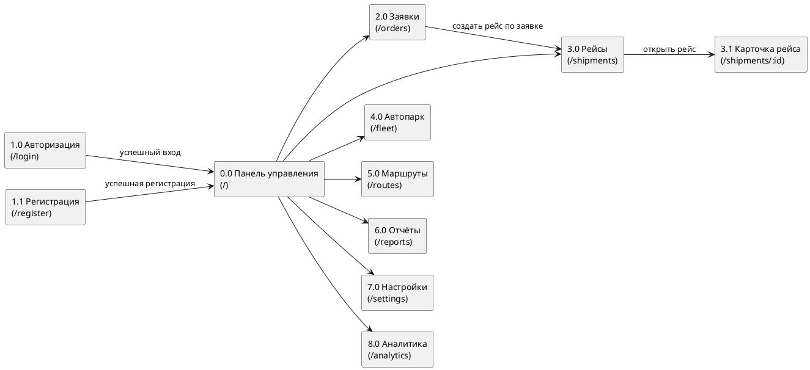

# 2 Проектирование дизайна web‑страниц

В настоящей главе представлены результаты проектирования пользовательского интерфейса разрабатываемого web‑приложения. Рассматриваются структура (навигация и связи страниц), текстовый прототип, а также перечень вайрфреймов и дизайн‑макетов для трёх целевых разрешений (desktop, tablet, mobile). Материалы главы используются в качестве основы для последующей реализации клиентской части, а также для контроля соответствия вёрстки принятым дизайн‑решениям.

## 2.1 Структура web‑приложения

Структура web‑приложения определяет способ организации страниц, доступа к ним и навигации. В целях обеспечения предсказуемости пользовательских сценариев и сокращения числа переходов между ключевыми разделами основные функциональные страницы размещены на верхнем уровне навигации, а детальные страницы (например, карточка рейса) — на следующем уровне.

Ниже представлена структура web‑приложения со ссылочными номерами страниц. Нумерация используется далее в текстовом прототипе, вайрфреймах и описании дизайн‑макетов.

### Диаграмма структуры (PlantUML)

<!-- PLACEHOLDER: вставить изображение диаграммы структуры -->
Рисунок 2.1 – Структура web‑приложения со ссылочными номерами страниц.

## 2.2 Текстовый прототип

Текстовый прототип фиксирует назначение страниц, состав основных блоков и элементы управления, а также ожидаемую интерактивность. В прототипе используются ссылочные номера страниц (см. рисунок 2.1), что обеспечивает единообразное соответствие между структурой, вайрфреймами и дизайн‑макетами.

Для уменьшения избыточной детализации текстовый прототип представлен в табличной форме.

| Ссылочный номер | Наименование страницы | Назначение и ключевые элементы |
|---:|---|---|
| 0.0 | Панель управления | Отображение показателей (KPI), списка последних рейсов и навигации по основным разделам; переход к деталям рейса осуществляется по выбору элемента списка. |
| 1.0 | Авторизация | Форма ввода e‑mail и пароля, запуск процедуры входа; предусмотрена обработка ошибок с выводом уведомлений; обеспечивается переход на страницу регистрации. |
| 1.1 | Регистрация | Форма ввода данных пользователя и выбора роли; предусмотрена валидация полей и обработка ошибок; обеспечивается переход на страницу авторизации. |
| 2.0 | Заявки | Просмотр и управление заявками: поиск и фильтрация, отображение списка с ключевыми полями, создание заявки и изменение статуса в рамках полномочий роли; параметры фильтров сохраняются в `localStorage`. |
| 3.0 | Рейсы | Просмотр и управление рейсами: фильтрация, создание рейса по заявке, смена статусов; переход к карточке рейса (3.1) осуществляется по выбору записи; параметры фильтров сохраняются в `localStorage`. |
| 3.1 | Карточка рейса | Детальное представление рейса: основные параметры, маршрут по точкам, лента событий; предусмотрено добавление событий и смена статуса в зависимости от роли. |
| 4.0 | Автопарк | Управление транспортом и водителями во вкладках; предусматриваются поиск/фильтрация и операции добавления/обновления записей; выбранная вкладка сохраняется в `localStorage`. |
| 5.0 | Маршруты | Управление маршрутами и точками маршрута (последовательность следования); предусматривается ввод и просмотр точек, а также валидация обязательных параметров. |
| 6.0 | Отчёты | Формирование и скачивание отчётов по рейсам и загрузке автопарка в форматах PDF/Excel; при наличии параметров формирования (например, период) они задаются на странице. |
| 7.0 | Настройки | Управление параметрами интерфейса (например, тема и плотность), а также сброс пользовательских настроек, сохранённых в `localStorage`. |
| 8.0 | Аналитика | Отображение графиков по выбранному периоду и перестановка карточек графиков методом drag‑and‑drop с сохранением порядка в `localStorage`. |

Таблица 2.1 – Перечень страниц и ключевых элементов текстового прототипа.

## 2.3 Вайрфреймы web‑страниц

Вайрфреймы предназначены для фиксации структуры страниц, расположения функциональных элементов и логики взаимодействия без детализации графического оформления. Для каждого экрана разрабатываются три варианта вайрфрейма: desktop, tablet и mobile.

Ниже приведён перечень вайрфреймов, подлежащих включению в пояснительную записку. В каждом подпункте необходимо разместить три изображения (desktop/tablet/mobile) и указать ссылочный номер страницы.

### 0.0 Панель управления (0.0)

<!-- PLACEHOLDER: вайрфрейм desktop -->
Рисунок 2.2 – Вайрфрейм страницы «Панель управления» (0.0), desktop.

<!-- PLACEHOLDER: вайрфрейм tablet -->
Рисунок 2.3 – Вайрфрейм страницы «Панель управления» (0.0), tablet.

<!-- PLACEHOLDER: вайрфрейм mobile -->
Рисунок 2.4 – Вайрфрейм страницы «Панель управления» (0.0), mobile.

### 1.0 Авторизация (1.0)

<!-- PLACEHOLDER: вайрфрейм desktop -->
Рисунок 2.5 – Вайрфрейм страницы «Авторизация» (1.0), desktop.

<!-- PLACEHOLDER: вайрфрейм tablet -->
Рисунок 2.6 – Вайрфрейм страницы «Авторизация» (1.0), tablet.

<!-- PLACEHOLDER: вайрфрейм mobile -->
Рисунок 2.7 – Вайрфрейм страницы «Авторизация» (1.0), mobile.

### 1.1 Регистрация (1.1)

<!-- PLACEHOLDER: вайрфрейм desktop -->
Рисунок 2.8 – Вайрфрейм страницы «Регистрация» (1.1), desktop.

<!-- PLACEHOLDER: вайрфрейм tablet -->
Рисунок 2.9 – Вайрфрейм страницы «Регистрация» (1.1), tablet.

<!-- PLACEHOLDER: вайрфрейм mobile -->
Рисунок 2.10 – Вайрфрейм страницы «Регистрация» (1.1), mobile.

### 2.0 Заявки (2.0)

<!-- PLACEHOLDER: вайрфрейм desktop -->
Рисунок 2.11 – Вайрфрейм страницы «Заявки» (2.0), desktop.

<!-- PLACEHOLDER: вайрфрейм tablet -->
Рисунок 2.12 – Вайрфрейм страницы «Заявки» (2.0), tablet.

<!-- PLACEHOLDER: вайрфрейм mobile -->
Рисунок 2.13 – Вайрфрейм страницы «Заявки» (2.0), mobile.

### 3.0 Рейсы (3.0)

<!-- PLACEHOLDER: вайрфрейм desktop -->
Рисунок 2.14 – Вайрфрейм страницы «Рейсы» (3.0), desktop.

<!-- PLACEHOLDER: вайрфрейм tablet -->
Рисунок 2.15 – Вайрфрейм страницы «Рейсы» (3.0), tablet.

<!-- PLACEHOLDER: вайрфрейм mobile -->
Рисунок 2.16 – Вайрфрейм страницы «Рейсы» (3.0), mobile.

### 3.1 Карточка рейса (3.1)

<!-- PLACEHOLDER: вайрфрейм desktop -->
Рисунок 2.17 – Вайрфрейм страницы «Карточка рейса» (3.1), desktop.

<!-- PLACEHOLDER: вайрфрейм tablet -->
Рисунок 2.18 – Вайрфрейм страницы «Карточка рейса» (3.1), tablet.

<!-- PLACEHOLDER: вайрфрейм mobile -->
Рисунок 2.19 – Вайрфрейм страницы «Карточка рейса» (3.1), mobile.

### 4.0 Автопарк (4.0)

<!-- PLACEHOLDER: вайрфрейм desktop -->
Рисунок 2.20 – Вайрфрейм страницы «Автопарк» (4.0), desktop.

<!-- PLACEHOLDER: вайрфрейм tablet -->
Рисунок 2.21 – Вайрфрейм страницы «Автопарк» (4.0), tablet.

<!-- PLACEHOLDER: вайрфрейм mobile -->
Рисунок 2.22 – Вайрфрейм страницы «Автопарк» (4.0), mobile.

### 5.0 Маршруты (5.0)

<!-- PLACEHOLDER: вайрфрейм desktop -->
Рисунок 2.23 – Вайрфрейм страницы «Маршруты» (5.0), desktop.

<!-- PLACEHOLDER: вайрфрейм tablet -->
Рисунок 2.24 – Вайрфрейм страницы «Маршруты» (5.0), tablet.

<!-- PLACEHOLDER: вайрфрейм mobile -->
Рисунок 2.25 – Вайрфрейм страницы «Маршруты» (5.0), mobile.

### 6.0 Отчёты (6.0)

<!-- PLACEHOLDER: вайрфрейм desktop -->
Рисунок 2.26 – Вайрфрейм страницы «Отчёты» (6.0), desktop.

<!-- PLACEHOLDER: вайрфрейм tablet -->
Рисунок 2.27 – Вайрфрейм страницы «Отчёты» (6.0), tablet.

<!-- PLACEHOLDER: вайрфрейм mobile -->
Рисунок 2.28 – Вайрфрейм страницы «Отчёты» (6.0), mobile.

### 7.0 Настройки (7.0)

<!-- PLACEHOLDER: вайрфрейм desktop -->
Рисунок 2.29 – Вайрфрейм страницы «Настройки» (7.0), desktop.

<!-- PLACEHOLDER: вайрфрейм tablet -->
Рисунок 2.30 – Вайрфрейм страницы «Настройки» (7.0), tablet.

<!-- PLACEHOLDER: вайрфрейм mobile -->
Рисунок 2.31 – Вайрфрейм страницы «Настройки» (7.0), mobile.

### 8.0 Аналитика (8.0)

<!-- PLACEHOLDER: вайрфрейм desktop -->
Рисунок 2.32 – Вайрфрейм страницы «Аналитика» (8.0), desktop.

<!-- PLACEHOLDER: вайрфрейм tablet -->
Рисунок 2.33 – Вайрфрейм страницы «Аналитика» (8.0), tablet.

<!-- PLACEHOLDER: вайрфрейм mobile -->
Рисунок 2.34 – Вайрфрейм страницы «Аналитика» (8.0), mobile.

## 2.4 Дизайн‑макеты web‑страниц

Дизайн‑макеты отражают итоговое визуальное решение интерфейса и фиксируют стилистику, компоненты взаимодействия и интерактивные состояния элементов. В соответствии с методическими рекомендациями для каждой основной страницы приводятся три макета: desktop, tablet и mobile, а также словесное описание структуры и интерактивности.

Ниже приведены места для размещения дизайн‑макетов. При вставке изображений следует обеспечить читабельность текста; при необходимости мелкие элементы рекомендуется выносить в приложения или в графическую часть.

### 0.0 Панель управления (0.0)

<!-- PLACEHOLDER: дизайн‑макет desktop -->
Рисунок 2.35 – Дизайн‑макет страницы «Панель управления» (0.0), desktop.

<!-- PLACEHOLDER: дизайн‑макет tablet -->
Рисунок 2.36 – Дизайн‑макет страницы «Панель управления» (0.0), tablet.

<!-- PLACEHOLDER: дизайн‑макет mobile -->
Рисунок 2.37 – Дизайн‑макет страницы «Панель управления» (0.0), mobile.

Описание структуры и интерактивности: при наведении на KPI‑карточки и элементы списка последних рейсов изменяется визуальное состояние и вид курсора; переход к карточке рейса выполняется по выбору соответствующей записи; доступность элементов навигации определяется ролью пользователя.

### 2.0 Заявки (2.0)

<!-- PLACEHOLDER: дизайн‑макет desktop -->
Рисунок 2.38 – Дизайн‑макет страницы «Заявки» (2.0), desktop.

<!-- PLACEHOLDER: дизайн‑макет tablet -->
Рисунок 2.39 – Дизайн‑макет страницы «Заявки» (2.0), tablet.

<!-- PLACEHOLDER: дизайн‑макет mobile -->
Рисунок 2.40 – Дизайн‑макет страницы «Заявки» (2.0), mobile.

Описание структуры и интерактивности: фильтры и поисковая строка изменяют состав списка заявок без перезагрузки страницы; кнопка сброса возвращает значения к исходным и очищает сохранённые параметры; для кнопок и полей ввода предусмотрены интерактивные состояния (hover/focus/disabled).

### 3.0 Рейсы (3.0) и 3.1 Карточка рейса (3.1)

<!-- PLACEHOLDER: дизайн‑макет рейсы desktop -->
Рисунок 2.41 – Дизайн‑макет страницы «Рейсы» (3.0), desktop.

<!-- PLACEHOLDER: дизайн‑макет карточка рейса desktop -->
Рисунок 2.42 – Дизайн‑макет страницы «Карточка рейса» (3.1), desktop.

<!-- PLACEHOLDER: дизайн‑макеты tablet/mobile по аналогии -->
Рисунок 2.43 – Дизайн‑макеты страниц «Рейсы» (3.0) и «Карточка рейса» (3.1), tablet и mobile.

Описание структуры и интерактивности: смена статуса рейса осуществляется через управляющие элементы, доступность которых определяется ролью; добавление события трекинга выполняется через форму, после отправки событие отображается в ленте; на странице карточки рейса предусмотрены представление маршрута по точкам и хронологическое отображение событий.

### 4.0 Автопарк (4.0) и 5.0 Маршруты (5.0)

<!-- PLACEHOLDER: дизайн‑макет автопарк -->
Рисунок 2.44 – Дизайн‑макет страницы «Автопарк» (4.0), desktop/tablet/mobile.

<!-- PLACEHOLDER: дизайн‑макет маршруты -->
Рисунок 2.45 – Дизайн‑макет страницы «Маршруты» (5.0), desktop/tablet/mobile.

Описание структуры и интерактивности: выбранная вкладка автопарка сохраняется и восстанавливается при повторном открытии страницы; для форм создания и редактирования предусмотрена валидация обязательных полей; порядок точек маршрута отражает последовательность следования.

### 6.0 Отчёты (6.0) и 7.0 Настройки (7.0)

<!-- PLACEHOLDER: дизайн‑макет отчёты -->
Рисунок 2.46 – Дизайн‑макет страницы «Отчёты» (6.0), desktop/tablet/mobile.

<!-- PLACEHOLDER: дизайн‑макет настройки -->
Рисунок 2.47 – Дизайн‑макет страницы «Настройки» (7.0), desktop/tablet/mobile.

Описание структуры и интерактивности: формирование отчёта запускается по выбору соответствующей команды и завершается скачиванием файла; переключатели настроек обеспечивают применение параметров интерфейса; кнопка сброса очищает пользовательские параметры и возвращает значения к исходным.

### 8.0 Аналитика (8.0)

<!-- PLACEHOLDER: дизайн‑макет аналитика -->
Рисунок 2.48 – Дизайн‑макет страницы «Аналитика» (8.0), desktop/tablet/mobile.

Описание структуры и интерактивности: изменение периода приводит к перестроению графиков по выбранному интервалу; карточки графиков допускают перестановку методом drag‑and‑drop, при этом порядок сохраняется в `localStorage`.

