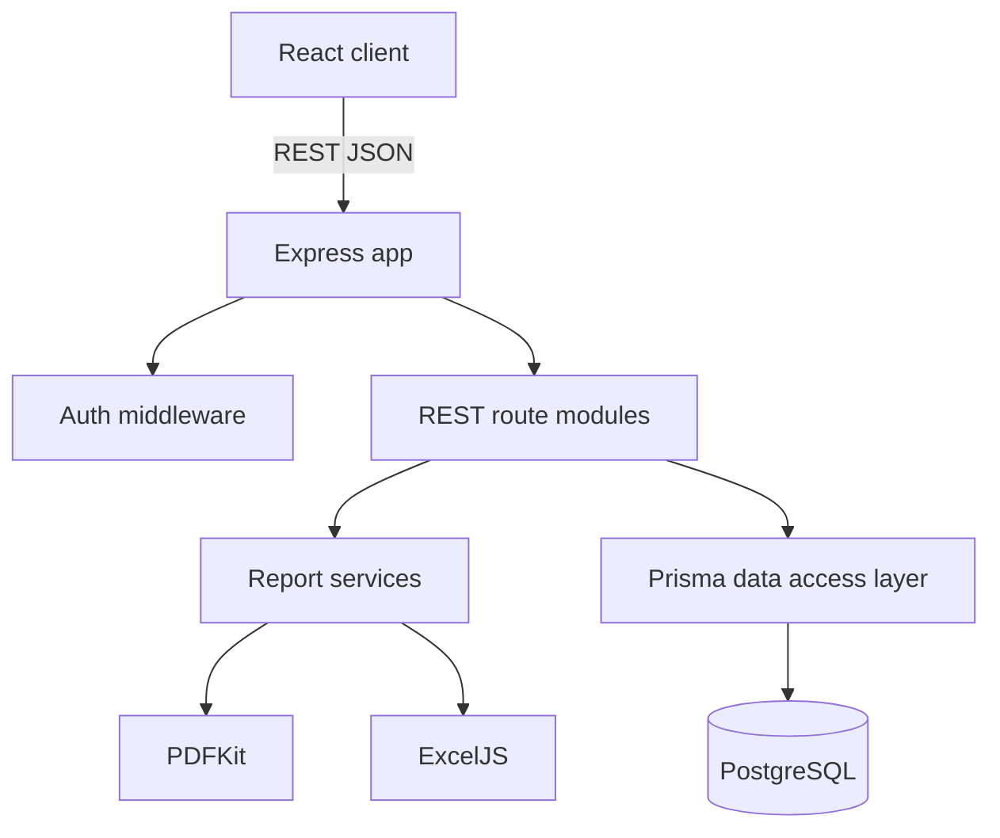
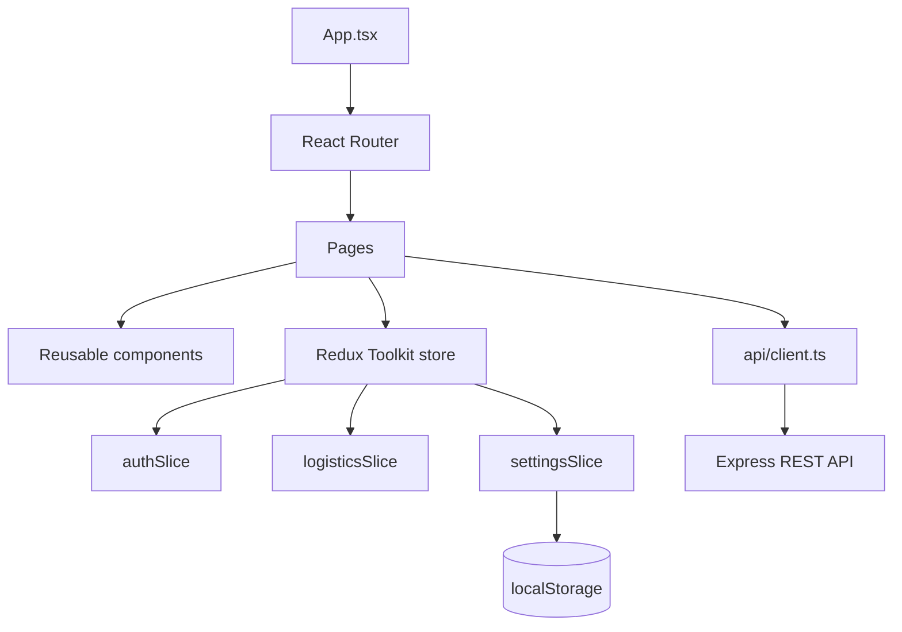

# Материалы для записки

## 1. Выбор технологий и инструментов

Для клиентской части используется React с TypeScript, Redux Toolkit для глобального состояния, React Router для маршрутизации и Webpack для сборки. Верстка выполнена на HTML5 и CSS без UI-фреймворка, чтобы явно показать собственные компоненты, адаптивность и интерактивные состояния.

Для серверной части используется Node.js и Express. Сервер предоставляет RESTful API, выполняет проверку JWT-токена, разграничивает доступ по ролям и взаимодействует с БД через Prisma ORM.

Для хранения данных используется PostgreSQL. Prisma выбрана как ORM, потому что схема данных описывается декларативно, поддерживаются миграции, типизированный клиент и seed-данные.

## 2. Роли пользователей

- Диспетчер: управляет заявками, рейсами, маршрутами, водителями, транспортом и отчетами.
- Клиент: регистрируется, создает заявки и отслеживает рейсы по своим перевозкам.
- Перевозчик: управляет рейсами, водителями, транспортом и получает отчеты по автопарку.

В приложении есть страницы авторизации и регистрации. Ролевая проверка реализована на сервере middleware `authenticate` и `requireRoles`, а на клиенте компонентом `RoleGate`.

## 3. Страницы клиентской части

Не считая авторизации и регистрации, реализовано 8 страниц:

1. Панель управления `/`.
2. Заявки `/orders`.
3. Рейсы `/shipments`.
4. Детальная карточка рейса `/shipments/:id`.
5. Автопарк `/fleet`.
6. Маршруты `/routes`.
7. Отчеты `/reports`.
8. Настройки `/settings`.

## 4. Функции приложения

Не считая авторизации и регистрации, реализованы функции:

1. Просмотр оперативных показателей.
2. Просмотр последних рейсов.
3. Поиск заявок.
4. Фильтрация заявок по статусу.
5. Создание заявки.
6. Обновление статуса заявки.
7. Просмотр списка рейсов.
8. Поиск рейсов.
9. Фильтрация рейсов по статусу.
10. Создание рейса.
11. Изменение статуса рейса.
12. Просмотр детальной карточки рейса.
13. Добавление события трекинга.
14. Просмотр маршрута рейса по точкам.
15. Просмотр транспорта.
16. Создание транспорта.
17. Просмотр водителей.
18. Создание водителя.
19. Просмотр маршрутов.
20. Создание маршрута.
21. Скачивание отчета по рейсам в PDF.
22. Скачивание отчета по автопарку в PDF.
23. Скачивание Excel-отчета по рейсам.
24. Скачивание Excel-отчета по автопарку.
25. Сохранение пользовательских фильтров и настроек в `localStorage`.
26. Сброс пользовательских настроек.

## 5. Компоненты интерфейса

Реализовано более 20 компонентов:

`AppShell`, `SideNav`, `TopBar`, `MobileNav`, `Button`, `Card`, `PageHeader`, `StatCard`, `MetricGrid`, `StatusBadge`, `PriorityPill`, `Toolbar`, `SearchInput`, `SelectField`, `TextInput`, `TextAreaField`, `FormGrid`, `EmptyState`, `SkeletonBlock`, `DataTable`, `Modal`, `Toast`, `Timeline`, `RoutePreview`, `ReportCard`, `SettingsToggle`, `RoleGate`, `DataList`, `KPIBar`, `MobileTabs`.

Интерактивность: hover-состояния ссылок, кнопок, строк таблицы и навигации; состояния disabled; focus-состояния полей; плавные переходы; мобильная нижняя навигация; модальные окна; сохранение выбранных фильтров.

## 6. Структура серверной части



Основные серверные модули:

- `src/app.ts` - создание Express-приложения и регистрация маршрутов.
- `src/index.ts` - запуск HTTP-сервера.
- `src/prisma.ts` - единый Prisma Client.
- `src/middleware/auth.ts` - проверка JWT и ролей.
- `src/middleware/error.ts` - единая обработка ошибок.
- `src/routes/*.ts` - REST API для сущностей.
- `src/services/reportService.ts` - формирование PDF и Excel-отчетов.

## 7. REST API

API использует JSON для обмена данными, кроме скачивания PDF и Excel-файлов.

Пример JSON авторизации:

```json
{
  "email": "dispatcher@transport.test",
  "password": "password123"
}
```

Ответ:

```json
{
  "token": "jwt-token",
  "user": {
    "id": "user-id",
    "name": "Анна Диспетчер",
    "email": "dispatcher@transport.test",
    "role": {
      "slug": "dispatcher",
      "name": "Диспетчер"
    }
  }
}
```

Основные endpoints:

- `POST /api/auth/register`, `POST /api/auth/login`, `GET /api/auth/me`.
- `GET /api/dashboard`.
- `GET /api/orders`, `POST /api/orders`, `GET /api/orders/:id`, `PATCH /api/orders/:id`, `DELETE /api/orders/:id`.
- `GET /api/shipments`, `POST /api/shipments`, `GET /api/shipments/:id`, `PATCH /api/shipments/:id`, `DELETE /api/shipments/:id`.
- `POST /api/shipments/:id/events`.
- `GET /api/vehicles`, `POST /api/vehicles`, `PATCH /api/vehicles/:id`, `DELETE /api/vehicles/:id`.
- `GET /api/drivers`, `POST /api/drivers`, `PATCH /api/drivers/:id`, `DELETE /api/drivers/:id`.
- `GET /api/routes`, `POST /api/routes`, `GET /api/routes/:id`, `PATCH /api/routes/:id`, `DELETE /api/routes/:id`.
- `GET /api/reports/shipments.pdf`, `GET /api/reports/fleet.pdf`.
- `GET /api/reports/shipments.xlsx`, `GET /api/reports/fleet.xlsx`.
- `GET /api/catalog`.

## 8. Структура клиентской части



Логика страниц:

- Панель: загружает `/api/dashboard`, показывает метрики и последние рейсы.
- Заявки: хранит фильтры в `localStorage`, загружает `/api/orders`, создает и обновляет заявки.
- Рейсы: хранит фильтры в `localStorage`, загружает `/api/shipments`, создает рейсы и меняет статусы.
- Детальная карточка рейса: загружает `/api/shipments/:id`, показывает маршрут и события, добавляет события.
- Автопарк: хранит активную вкладку в `localStorage`, загружает транспорт и водителей, создает новые записи.
- Маршруты: загружает `/api/routes`, создает маршрут с точками.
- Отчеты: скачивает PDF и Excel-файлы по текущим данным приложения.
- Настройки: изменяет тему, плотность, состояние меню, фокус панели и флаг уменьшения анимаций.

## 9. База данных

В БД более 8 связанных таблиц:

### roles

Роли пользователей.

- `id String PK`
- `slug String UNIQUE`
- `name String`
- `description String`

### companies

Компании клиентов, перевозчиков и платформы.

- `id String PK`
- `name String`
- `type CompanyType`
- `taxNumber String UNIQUE NULL`
- `address String NULL`
- `contactEmail String NULL`
- `phone String NULL`
- `createdAt DateTime`
- `updatedAt DateTime`

### users

Пользователи системы.

- `id String PK`
- `email String UNIQUE`
- `passwordHash String`
- `name String`
- `status UserStatus`
- `roleId String FK -> roles.id`
- `companyId String NULL FK -> companies.id`
- `createdAt DateTime`
- `updatedAt DateTime`

### cargo

Грузы по заявкам.

- `id String PK`
- `name String`
- `type CargoType`
- `weightKg Decimal(10,2)`
- `volumeM3 Decimal(10,2)`
- `temperatureFrom Int NULL`
- `temperatureTo Int NULL`
- `hazardClass String NULL`

### orders

Заявки на перевозку.

- `id String PK`
- `code String UNIQUE`
- `title String`
- `status OrderStatus`
- `priority Priority`
- `pickupAddress String`
- `deliveryAddress String`
- `pickupDate DateTime`
- `deliveryDate DateTime`
- `price Decimal(12,2)`
- `notes String NULL`
- `clientId String FK -> companies.id`
- `cargoId String FK -> cargo.id`
- `createdById String FK -> users.id`
- `createdAt DateTime`
- `updatedAt DateTime`

### vehicles

Транспортные средства перевозчика.

- `id String PK`
- `plateNumber String UNIQUE`
- `type String`
- `make String NULL`
- `model String NULL`
- `year Int NULL`
- `capacityKg Decimal(10,2)`
- `capacityM3 Decimal(10,2)`
- `status VehicleStatus`
- `companyId String FK -> companies.id`
- `createdAt DateTime`
- `updatedAt DateTime`

### drivers

Водители перевозчика.

- `id String PK`
- `licenseNumber String UNIQUE`
- `name String`
- `phone String`
- `email String NULL`
- `rating Decimal(3,2)`
- `status DriverStatus`
- `companyId String FK -> companies.id`
- `userId String UNIQUE NULL FK -> users.id`
- `createdAt DateTime`
- `updatedAt DateTime`

### routes

Маршруты перевозок.

- `id String PK`
- `name String`
- `origin String`
- `destination String`
- `distanceKm Decimal(10,2)`
- `estimatedHours Int`
- `createdAt DateTime`
- `updatedAt DateTime`

### route_points

Точки маршрута.

- `id String PK`
- `routeId String FK -> routes.id`
- `sequence Int`
- `label String`
- `address String`
- `latitude Decimal(9,6)`
- `longitude Decimal(9,6)`
- `plannedArrival DateTime NULL`
- `createdAt DateTime`
- `UNIQUE(routeId, sequence)`

### shipments

Рейсы по заявкам.

- `id String PK`
- `trackingNumber String UNIQUE`
- `status ShipmentStatus`
- `orderId String FK -> orders.id`
- `carrierId String FK -> companies.id`
- `driverId String FK -> drivers.id`
- `vehicleId String FK -> vehicles.id`
- `routeId String NULL FK -> routes.id`
- `plannedStart DateTime`
- `actualStart DateTime NULL`
- `plannedFinish DateTime`
- `actualFinish DateTime NULL`
- `currentLatitude Decimal(9,6) NULL`
- `currentLongitude Decimal(9,6) NULL`
- `createdAt DateTime`
- `updatedAt DateTime`

### shipment_events

События трекинга рейса.

- `id String PK`
- `shipmentId String FK -> shipments.id`
- `type EventType`
- `message String`
- `location String NULL`
- `latitude Decimal(9,6) NULL`
- `longitude Decimal(9,6) NULL`
- `createdById String NULL FK -> users.id`
- `createdAt DateTime`

### report_requests

История формирования отчетов.

- `id String PK`
- `type ReportType`
- `delivery ReportDelivery`
- `recipientEmail String NULL`
- `fileName String NULL`
- `status String`
- `createdById String FK -> users.id`
- `createdAt DateTime`

## 10. Нормализация до 3НФ

Первая нормальная форма: все поля атомарны; повторяющиеся точки маршрута вынесены в отдельную таблицу `route_points`, события рейса вынесены в `shipment_events`.

Вторая нормальная форма: у таблиц с простыми первичными ключами все неключевые атрибуты зависят от первичного ключа целиком. Для `route_points` введено ограничение `UNIQUE(routeId, sequence)`, но первичный ключ остается `id`, поэтому частичных зависимостей нет.

Третья нормальная форма: транзитивные зависимости вынесены в отдельные таблицы. Например, данные клиента не хранятся в `orders`, а находятся в `companies`; данные транспорта и водителя не дублируются в `shipments`, а связаны внешними ключами; роль пользователя не хранится строкой в `users`, а вынесена в `roles`.

## 11. Руководство системного программиста

Требования:

- Node.js 20 или новее.
- PostgreSQL 16 или Docker.
- Google Chrome последней версии для проверки клиентской части.

Порядок запуска:

1. `npm install`
2. `copy .env.example .env`
3. `docker compose up -d`
4. `npm run prisma:migrate`
5. `npm run seed`
6. `npm run dev`

Проверка:

- `npm run typecheck`
- `npm run build`

Excel-отчеты формируются на сервере через `exceljs`: каждый отчет содержит шапку, лист с итогами и группировкой, а также отдельную табличную часть.

## 12. Тестовый пример

1. Запустить приложение и открыть `http://localhost:3000`.
2. Войти как `dispatcher@transport.test` с паролем `password123`.
3. На панели управления убедиться, что отображаются заявки, рейсы, транспорт и водители.
4. Перейти на страницу "Заявки" и создать новую заявку.
5. Перейти на страницу "Рейсы" и создать рейс по существующей заявке.
6. Изменить статус рейса на "В пути".
7. Открыть детальную карточку рейса и добавить событие "Контрольная точка".
8. Перейти на страницу "Автопарк" и добавить транспортное средство.
9. Перейти на страницу "Маршруты" и добавить маршрут с двумя точками.
10. Перейти на страницу "Отчеты", скачать PDF "Сводка рейсов".
11. На той же странице скачать Excel-отчет "Загрузка автопарка".
12. Перейти на страницу "Настройки", изменить тему и плотность.
13. Перезагрузить страницу и убедиться, что параметры сохранились.
14. Нажать "Сброс настроек" и убедиться, что параметры вернулись к значениям по умолчанию.
